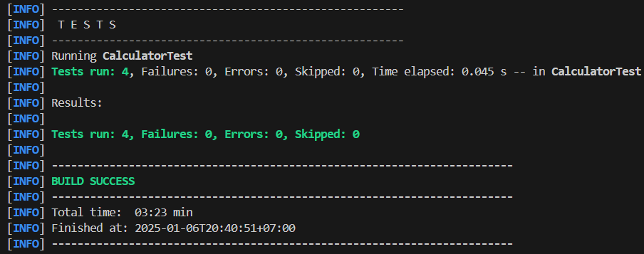

# **Bài tập kiểm thử với Java**

---

## **1. Giới thiệu**

Đây là bài tập kiểm thử phần mềm sử dụng ngôn ngữ Java nhằm mục đích thực hành các kỹ thuật kiểm thử đơn vị (Unit Testing) và tích hợp (Integration Testing). Bài tập bao gồm:

- Viết mã nguồn Java cho các chức năng cần kiểm thử.
- Triển khai kiểm thử bằng **JUnit**.

---

## **2. Cấu trúc dự án**

```
project-directory/
│
├── src/main/java/
│   ├── com.longma/
│   │   ├── Calculator.java    # Lớp chính cần kiểm thử
│   │   └── Main.java              # Lớp main
│
├── src/test/java/
│   ├── com.longma/
│   │   ├── CalculatorTest.java # Kiểm thử đơn vị
│   │   └── ...                # Các lớp kiểm thử khác
│
├── pom.xml                    # Cấu hình Maven
├── README.md                  # Tài liệu mô tả
└── ...
```

---

## **3. Yêu cầu**

1. **Công cụ và công nghệ:**
   - Ngôn ngữ: Java
   - Công cụ kiểm thử: JUnit (phiên bản 5.x)
   - Build tool: Maven hoặc Gradle (tùy chọn)

2. **Các chức năng cần kiểm thử:**
   - **Calculator.java:**
     - Phép cộng (`add(int a, int b)`)
     - Phép trừ (`subtract(int a, int b)`)
     - Phép nhân (`multiply(int a, int b)`)
     - Phép chia (`divide(int a, int b)`), bao gồm xử lý lỗi khi chia cho 0.

---

## **4. Cài đặt**

1. **Clone dự án:**
   ```bash
   git clone https://github.com/maduylong2004/SoftwereTesting.git
   cd SoftwereTesting
   ```

2. **Cấu hình Maven:**
   - Đảm bảo file `pom.xml` có chứa dependency JUnit:
     ```xml
     <dependency>
         <groupId>org.junit.jupiter</groupId>
         <artifactId>junit-jupiter-engine</artifactId>
         <version>5.10.3</version>
         <scope>test</scope>
     </dependency>
     ```

3. **Chạy kiểm thử:**
   ```bash
   mvn test
   ```

---

## **5. Hướng dẫn sử dụng**

- **Lớp Calculator:**
  - Mã nguồn nằm trong `src/main/java/com.longma/Calculator.java`.
  - Bao gồm các phương thức để thực hiện các phép tính cơ bản.

- **Kiểm thử đơn vị:**
  - Các bài kiểm thử nằm trong `src/test/java/com.longma/CalculatorTest.java`.
  - Ví dụ một bài kiểm thử:
    ```java
    @Test
    public void testAddition() {
        Calculator calculator = new Calculator();
        assertEquals(5, calculator.add(2, 3));
    }
    ```

---

## **6. Kết quả mong đợi**

- Tất cả bài kiểm thử đều chạy thành công.
- Báo cáo kiểm thử hiển thị số lượng bài kiểm thử đã chạy, số bài kiểm thử thành công và thất bại.
  
---

## **7. Tham khảo ChatGPT**

- Dưới đây là link dẫn đến bài hướng dẫn của ChatGPT
  ```
  https://chatgpt.com/share/677b497d-8630-800f-8248-09747b96c387
  ```
---

## **8. Liên hệ**

- **Tác giả:** Ma Duy Long
- **Email:** maduylong04@gmail.com
- **GitHub:** [Long Ma](https://github.com/maduylong2004)
